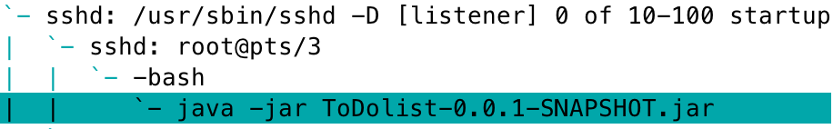
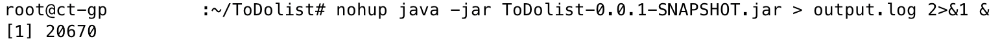
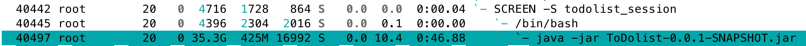

# 在服务器上部署 Spring Boot Application

## 连接服务器

## 安装 JDK

>  不确定 JDK 版本号，在 apt 包管理器中搜索包含 JDK 名称的软件包

``` shell
apt search --names-only jdk
```

安装 JDK

```shell
apt install openjdk-17-jdk
```

检查是否安装成功

```shell
java -version
```

> JDK 和 jre ？

## 安装数据库

```shell
apt install default-mysql-server
```

由于 MySQL server 的 apt 仓库没有包含在系统的软件仓库列表中，因此装了 MariaDB。

修改密码

```shell
service mysql restart
mysql -u root mysql
MariaDB [mysql]> FLUSH PRIVILEGES;
MariaDB [mysql]> ALTER USER 'root'@'localhost' IDENTIFIED BY '******';
```

创建数据库

```shell
mysql -u root -p
MariaDB [(none)]> CREATE DATABASE todolistdb;
```

## 生成 JAR 文件

```
 mvn package
```

将 Spring Boot application 打包成 JAR 文件。

## 将 JAR 文件传到服务器上

```shell
scp .../ToDolist/target/ToDolist-0.0.1-SNAPSHOT.jar root@10.112.98.40:/root/ToDolist
```

## 运行 Spring Boot Application

```shell
java -jar ToDolist-0.0.1-SNAPSHOT.jar
```

报错

```shell
Exception in thread "main" java.lang.UnsupportedClassVersionError: com/example/ToDolist/ToDolistApplication has been compiled by a more recent version of the Java Runtime (class file version 65.0), this version of the Java Runtime only recognizes class file versions up to 61.0
```

原来的项目是 JDK21 编译的，但是服务器中安装的是 JDK17，版本过低导致无法运行。

[参考资料](https://www.baeldung.com/java-lang-unsupportedclassversion)

解决方案如下。

- 服务器端
  - 升级 JDK 版本

- 本地
  1. 使用 JDK17 重新编译
  2. 用现有高版本 JDK 编译低版本字节码

但是在实际生产中修改服务器中 JDK 版本是不现实的，在本地降级 JDK 版本也比较繁琐，因此选择在本地用原有 JDK 来编译出低版本字节码的 JAR 文件，再到服务器上运行。

修改 `pom.xml` 配置

```java
	<properties>
		<java.version>17</java.version>
		<maven.compiler.source>17</maven.compiler.source>
		<maven.compiler.target>17</maven.compiler.target>
		<maven.test.skip>true</maven.test.skip>
	</properties>
```

再次打包上传至服务器运行，仍报相同错误。检查发现，只有 Spring 的代码是编译到了低版本字节码，但自己写的代码部分仍是高版本，说明没有清理缓存，仍保留了未修改配置前的编译结果。

清理缓存

```shell
mvn clean
```

重新打包上传后，运行成功。

## 后台运行

当本地的 ssh 断开后，会发现运行的程序也停止了。



通过 `htop` 查看进程，可以看到 java 是 bash 的子进程，bash 是 ssh 的子进程，因此 ssh 进程结束后，下面的子进程也都会结束。

想要 ToDolist 程序一直在后台运行，就需要将其挂到别的进程下。

1. [ nohup ](https://medium.com/@devmahmud.cse/start-spring-boot-application-in-the-background-linux-server-45342d49f145)
nohup (No Hang Up) 是 Linux 系统中的一个命令，即使从终端注销后也能运行该进程。
```
nohup java -jar ToDolist-0.0.1-SNAPSHOT.jar &
```

> - `nohup`: Runs the command detached from the terminal.
> -  `java -jar your-application.jar`: Executes the Spring Boot application.
> -  `> output.log 2>&1`: Redirects both standard output and error to a log file.
> -  `&`: Runs the command in the background.




可以看到，ToDolist 程序没有挂在 ssh 进程下，实现了后台运行。

2. [screen](https://linuxize.com/post/how-to-use-linux-screen/)

安装 screen

```shell
apt install screen
```

创建 todolist 会话，在当前会话中运行 Spring Boot Application。

```shell
screen -S todolist_session
```

> **Detach from Linux Screen Session**
> `Ctrl+a` `d` 

脱离会话后，screen session 中运行的程序会继续运行。



通过 `htop` 查看进程， ToDolist 程序挂在 screen 进程下运行。

> **Kill detached screen session**
>
> identify the detached screen session
> 
> ```shell
>screen -list
> ```
>
> ```shell
> There are screens on:
> 	40442.todolist_session	(02/18/25 00:34:03)	(Detached)
> 	21045.pts-3.ct-gpu-zmttest	(02/05/25 08:54:03)	(Detached)
> ```
>
> ```shell
> screen -S 21045 -X quit
> ```

> **Restore screen**
>
> ```shell
> screen -r 40442
> ```

> Working with Linux Screen Windows
>
> - `Ctrl+a` `c` Create a new window (with shell).
> - `Ctrl+a` `"` List all windows. 