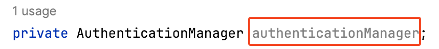

## 问题描述
在 Spring Boot 中使用 Spring Security + JWT 实现基于 Token 的身份认证时，我在 SecurityConfig 配置类中定义了 AuthenticationManager 方法用来实现请求中用户名和密码的认证。
```java
    @Bean
    public AuthenticationManager customAuthenticationManager(UserDetailsService userDetailsService,
                                                             PasswordEncoder encoder) {
        return authentication -> {
            String username = authentication.getPrincipal() + "";
            String password = authentication.getCredentials() + "";
            UserDetails user = userDetailsService.loadUserByUsername(username);
            if (!encoder.matches(password, user.getPassword())) {
                throw new UnauthorizedException("密码错误");
            }
            if (!user.isEnabled()) {
                throw new DisabledException("账户未启用");
            }
            return new UsernamePasswordAuthenticationToken(username, null, user.getAuthorities());
        };
    }
```
在 UserController 类中我进行了声明。
```java
@RequiredArgsConstructor
public class UserController {
private AuthenticationManager authenticationManager;
...
}
```
并调用这个方法来进行用户认证。
```java
Authentication authentication = authenticationManager.authenticate(
                    new UsernamePasswordAuthenticationToken(username, authRequest.getPassword())
            );
```
但是运行项目，输入用户名和密码后，出现了报错
```
2024-09-05T16:06:23.723+08:00 ERROR 70041 --- [ToDolist] [nio-8080-exec-5] o.a.c.c.C.[.[.[/].[dispatcherServlet]    : Servlet.service() for servlet [dispatcherServlet] in context with path [] threw exception [Request processing failed: java.lang.NullPointerException: Cannot invoke "org.springframework.security.authentication.AuthenticationManager.authenticate(org.springframework.security.core.Authentication)" because "this.authenticationManager" is null] with root cause
```
报错中显示 `"this.authenticationManager" is null] with root cause`，debug 发现是没有正确注入。

## 解决方案
### 使用 @Autowired 注入
尝试将 `@RequiredArgsConstructor` 替换成 `@Autowired`，成功注入了。但是 IDEA 不建议使用 `@Autowired`。
### 使用 @AllArgsConstructor 注入
尝试将 `@RequiredArgsConstructor` 替换成 `@AllArgsConstructor`，也成功注入了。
### 修改 @RequiredArgsConstructor
查阅 [说明文档](https://projectlombok.org/api/lombok/RequiredArgsConstructor) 发现，`@RequiredArgsConstructor` 只会构造被 final 修饰或者 no-null 的字段，没有被 final 修饰或者 no-null 的属性无法被注入。当我更改声明为 final 后，成功注入。
```java
private final AuthenticationManager authenticationManager;
```
## 总结
我一开始没有正确使用 `@RequiredArgsConstructor` 是因为理解错了其中 `Required` 的意思，以为我用到了所需的字段，它就能帮我自动注入，实际上该字段是需要被 final 修饰的。因此
- 建议避免使用 `@Autowired` 是因为它有时会导致依赖关系不够明确
- 当要生成包含所有字段的构造函数时，使用 `@AllArgsConstructor`
- 当要生成仅包含所需字段的构造函数时，使用 `@RequiredArgsConstructor`
- 通过构造函数注入的依赖项使得依赖关系更加明确；声明为 final，使得类更加不可变，增加了代码的安全性和可预测性。
